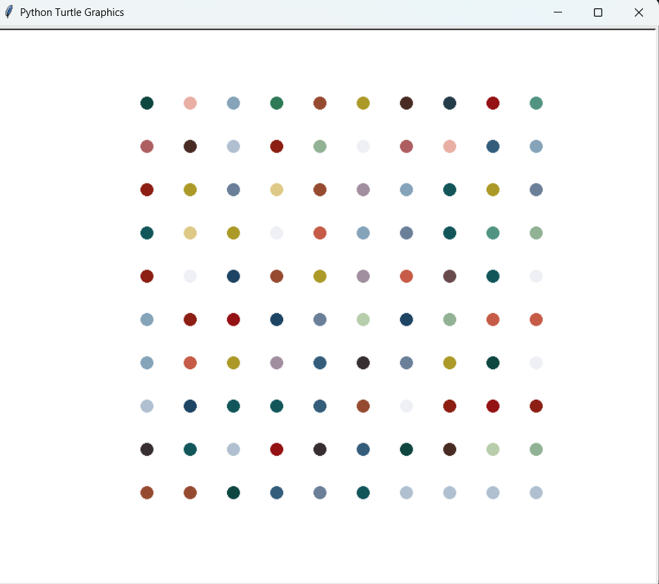

# 🎨 Hirst Painting in Python (Turtle Graphics)

This project recreates a **Hirst-style dot painting** using Python’s `turtle` module.  
It generates a 10x10 grid of colored dots inspired by Damien Hirst’s artwork.

The colors are selected randomly from a predefined RGB color palette.

---

## 🚀 Features

- Uses Python `turtle` for graphics
- Random color selection for each dot
- 10 × 10 dot grid
- Clean and minimal implementation

---

## 🛠️ Technologies Used

- Python 3
- turtle
- random
- numpy
- colorgram.py

---

## 📦 Installation

1. Clone the repository:

```bash
git clone https://github.com/your-username/hirst-painting.git
cd hirst-painting
```
2. Install dependencies:

```bash
pip install -r requirements.txt
```
3. Run the app:

```bash
python app.py
```

---

## 🖼️ Output Screenshot
